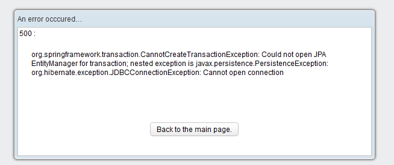

# CannotCreateTransaction


To resolve the issue you're encountering with the `BeanCreationException`, you'll need to follow a systematic approach to diagnosing and fixing the problem. 

### Log Review

The log indicates the following issues:
1. **Exception in Listener Initialization**: 
   ```
   org.apache.catalina.core.StandardContext.listenerStart Exception sending context initialized event to listener instance of class [org.springframework.web.context.ContextLoaderListener]
   ```
   This suggests that there was an issue during the initialization of the `ContextLoaderListener`, which is responsible for loading the Spring application context.

2. **Bean Creation Exception**: 
   ```
   org.springframework.beans.factory.BeanCreationException: Error creating bean with name 'parametresManager' defined in class path resource [applicationContextManager.xml]: Instantiation of bean failed
   ```
   This indicates a problem specifically with the `parametresManager` bean defined in `applicationContextManager.xml`.

### Steps to Resolve the Issue

1. **Check Bean Definition**:
   - Open the `applicationContextManager.xml` file and review the definition of the `parametresManager` bean. Ensure that it is properly defined and that all required properties and dependencies are specified correctly.

2. **Inspect Constructor and Initialization Logic**:
   - Look at the `parametresManager` class and check its constructor and any initialization methods (`@PostConstruct` or initialization blocks). Ensure that the constructor does not throw any exceptions and that all dependencies are correctly injected.

3. **Dependency Injection Issues**:
   - Verify that any dependencies required by `parametresManager` are correctly defined in the Spring configuration. Ensure that these dependencies are available and properly configured in the application context.

4. **Check for Bean Factory Issues**:
   - Ensure that there are no issues in the Spring configuration that might affect the bean factory or application context. Problems such as incorrect bean scopes or missing bean definitions can lead to `BeanCreationException`.

5. **Look for Nested Exceptions**:
   - Often, `BeanCreationException` will have nested exceptions that provide more details about the root cause. Check the full stack trace for any nested exceptions that might indicate the underlying problem.

6. **Validate Configuration Files**:
   - Make sure that your XML configuration files, including `applicationContextManager.xml`, are valid and properly formatted. Any errors in XML syntax or incorrect bean definitions can lead to failures during bean instantiation.

7. **Review Logs for Additional Context**:
   - Review the complete log files around the time of the error. Additional context or stack traces might give more insight into what’s going wrong.

### Example Resolution Steps

Suppose the `parametresManager` bean requires another bean that isn't defined. You might see an error like:

```
Caused by: org.springframework.beans.factory.NoSuchBeanDefinitionException: No bean named 'requiredDependency' available
```

In this case, you should:

- Define the missing `requiredDependency` bean in `applicationContextManager.xml` or another configuration file.
- Ensure that the `parametresManager` bean is correctly referencing it.

### Summary

1. **Check `applicationContextManager.xml`**: Ensure that the bean definition is correct and all required properties are set.
2. **Inspect `parametresManager` Class**: Verify the constructor and initialization logic.
3. **Verify Dependencies**: Ensure all dependencies are properly injected and available.
4. **Check for Nested Exceptions**: Look at the complete stack trace for more details.
5. **Validate Configuration Files**: Ensure XML configuration files are correct and well-formed.

By following these steps, you should be able to identify and resolve the issue causing the `BeanCreationException`. If the problem persists, providing more details about the exception or the `parametresManager` class might be necessary for further diagnosis.