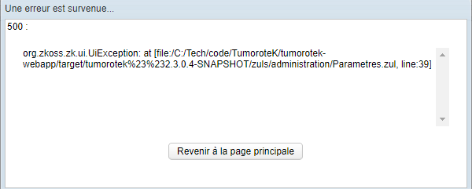

# "Problem In Line" Error

## Overview
When encountering this error, the initial instinct is to check your ZUL file. However, the source of the problem isn't always in the ZUL itself - sometimes it's in the controller.

## Troubleshooting Steps

### 1. Check the ZUL File
Examine your ZUL file and locate the controller binding element. It typically looks like this:

```xml
viewModel="@id('vm') @init('fr.aphp.tumorotek.action.administration.ParametresController')">
```

### 2. Verify Syntax
* First, check for any syntax errors in the ZUL file
* If the syntax is correct but the error persists, the issue likely lies in the controller

### 3. Next Steps
If you've confirmed the ZUL syntax is correct, debug the controller class instead of continuing to investigate the ZUL file.

# ZK UI Exception



## Overview
When encountering a ZK UI Exception, the issue might not always be where you expect it. While the natural instinct is to check the ZUL file, sometimes the root cause lies in the controller.

## Troubleshooting Steps

### 1. Check the ZUL File
First, examine your ZUL file, particularly elements that link to controllers. Look for declarations like:

```xml
viewModel="@id('vm') @init('fr.aphp.tumorotek.action.administration.ParametresController')"
```

### 2. Verify Syntax
- Ensure there are no syntax errors in the ZUL file
- Check for proper quotation marks and parentheses
- Verify the controller path is correct

### 3. Debug the Controller
If the ZUL syntax appears correct, the issue likely resides in the controller class. In this case:
- Set breakpoints in your controller
- Check the initialization methods
- Verify the viewModel bindings

## Common Causes
- Incorrect controller path
- Missing or incorrect viewModel bindings
- Controller initialization errors
- Runtime exceptions in controller methods