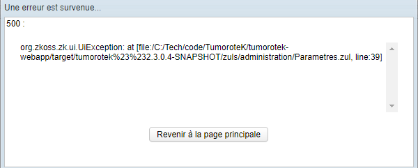

# ZK UI Exception


When having this error you should check your ZUL for the source of the problem. What is surprising is that in some cases, the source of the problem is not the ZUL, but the controller. But how can you tell?
After examining the ZUL file, if you see that the line with an element that links to the controller like this:

```
viewModel="@id('vm') @init('fr.aphp.tumorotek.action.administration.ParametresController')">
```

First, you should check that there are no syntax errors. In this case, there aren't any. In such a scenario, you should debug the controller Class and not the ZUL.